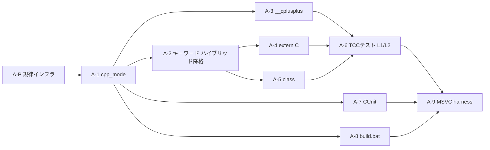

# TCC C++98 実装詳細ガイド

**文書版**：v2.5（[レビューその4.md](レビューその4.md)～[レビューその8.md](レビューその8.md) 反映）  
**更新日**：2026-05-24  
**対象**：C++ 基盤実装プラン（拡張子判定・`__cplusplus`・`extern "C"`・`class` 最小パース・テスト・ビルド）  
**参照**：[PLAN.md](PLAN.md)、[TCC_CPP.md](TCC_CPP.md)、[問題と原因.md](問題と原因.md)、[レビューその4.md](レビューその4.md)、[レビューその5.md](レビューその5.md)、[レビューその6.md](レビューその6.md)、[レビューその7.md](レビューその7.md)、[レビューその8.md](レビューその8.md)

---

## 目次

### Part A — C++ 基盤実装詳細ガイド（レビュー用・実装前に読む）

| # | ガイド | 変更ファイル |
|---|--------|-------------|
| A-P | [作業規律・インフラ（コード着手前）](#a-p-作業規律インフラコード着手前) | `build.bat`, `.githooks/`, `dev/test/` |
| A-R | [レビューその4 反映サマリー](#a-r-レビューその4-反映サマリー) | — |
| A-R5 | [レビューその5 反映サマリー](#a-r5-レビューその5-反映サマリー) | — |
| A-R6 | [レビューその6 反映サマリー](#a-r6-レビューその6-反映サマリー) | — |
| A-R7 | [レビューその7 反映サマリー](#a-r7-レビューその7-反映サマリー) | — |
| A-R8 | [レビューその8 反映サマリー](#a-r8-レビューその8-反映サマリー) | — |
| A-0 | [現状と実装原則](#a-0-現状と実装原則) | — |
| A-1 | [cpp_mode フラグと拡張子判定](#a-1-cpp_mode-フラグと拡張子判定) | `tcc.h`, `libtcc.c` |
| A-2 | [C++ キーワードの条件付き有効化](#a-2-c-キーワードの条件付き有効化) | `tccpp.c` |
| A-3 | [`__cplusplus` マクロ定義](#a-3-__cplusplus-マクロ定義) | `tccpp.c` |
| A-4 | [`extern "C"` 最小実装](#a-4-extern-c-最小実装) | `tcc.h`, `tccgen.c` |
| A-5 | [`class` 最小パース（Stage 1）](#a-5-class-最小パースstage-1) | `tccgen.c` |
| A-6 | [CPPUnit テスト実装](#a-6-cppunit-テスト実装) | `test/cppuniut/` |
| A-7 | [CUnit テスト整備](#a-7-cunit-テスト整備) | `test/vs_test/` |
| A-8 | [TCC ビルドと dev 配置](#a-8-tcc-ビルドと-dev-配置) | `build.bat`, `tcc.vcxproj`, `dev/tcc_set.bat` |
| A-9 | [MSVC テスト実行](#a-9-msvc-テスト実行) | `test/vs_test/build_vs_vs_test.bat` |
| A-10 | [実装順序・DAG・自動検証](#a-10-実装順序dag自動検証) | — |
| A-11 | [考慮漏れ・実装規約](#a-11-考慮漏れ実装規約) | 各所 |

### Part B — 付録（Stage 2 以降・補足資料）

1. [libcunit.a 改造ポイント（Stage 別）](#1-libcunita-改造ポイントstage-別)
2. [TCC ビルドスクリプト完全版](#2-tcc-ビルドスクリプト完全版)
3. [ABI 別 `this` レジスタ配置のコード例](#3-abi-別-this-レジスタ配置のコード例)
4. [テスト出力ログテンプレート](#4-テスト出力ログテンプレート)
5. [メンバポインタ移行条件チェックリスト](#5-メンバポインタ移行条件チェックリスト)

---

# Part A — C++ 基盤実装詳細ガイド

> **レビュー観点**：v2.5 は [レビューその4](レビューその4.md)～[レビューその8](レビューその8.md) を反映済み。  
> **コードを 1 行も触る前に [A-P](#a-p-作業規律インフラコード着手前) を完了すること**（P-5 のファイル作成含む）。  
> 実装は **1 ガイド = 1 ブランチ = 1 コミット**。手動チェックリストではなく `build.bat` / pre-commit でゲートする。

---

## A-P. 作業規律・インフラ（コード着手前）

[レビューその4.md](レビューその4.md) §1・§4-1 に基づく。**A-1 より先に実施**。

### P-1. ベースライン固定

```batch
git remote -v
REM origin がある場合のみ push
git tag clean-baseline-2026-05-24
git push origin clean-baseline-2026-05-24
```

- リモートが無いローカル専用リポジトリでは **tag のみ** 作成（push しない）
- 各ガイド（A-1～A-9）の作業は **`clean-baseline-2026-05-24` からの diff** として管理

### P-2. ブランチ運用

| ルール | 内容 |
|--------|------|
| 作業単位 | **1 ガイド = 1 feature branch**（例：`feature/a1-cpp-mode`） |
| 壊れたとき | `git checkout tccgen.c` 等の**直接復元禁止**。branch を捨ててタグから再 branch |
| マージ条件 | `msbuild` + smoke + 回帰テストがすべて緑 |
| master | 常にビルド可能な状態のみ |

### P-3. コミット規約

- **1 ガイド完了 = 必ず 1 コミット**（壊れている状態ではコミットしない）
- コミットメッセージ例：`feat(cpp): A-1 cpp_mode and extension detection`

### P-4. pre-commit フック（手動チェックリストの代替）

**Git Bash 版** — `.githooks/pre-commit`：

```sh
#!/bin/sh
msbuild tcc.vcxproj /p:Configuration=Release /p:Platform=x64 /t:Build /v:quiet || exit 1
dev/tcc.exe dev/test/repro_double6.c -o dev/test/repro_double6.exe && dev/test/repro_double6.exe || exit 1
```

**Windows / PowerShell 向け** — `.githooks/pre-commit.bat`（推奨併用）：

```batch
@echo off
msbuild tcc.vcxproj /p:Configuration=Release /p:Platform=x64 /t:Build /v:quiet
if errorlevel 1 exit /b 1
dev\tcc.exe dev\test\repro_double6.c -o dev\test\repro_double6.exe
if errorlevel 1 exit /b 1
dev\test\repro_double6.exe
if errorlevel 1 exit /b 1
```

`.githooks/pre-commit` から `.bat` を呼ぶラッパーでも可。  
**bash 非依存環境**では `core.hooksPath` を `.githooks` にしたうえで、pre-commit を `.bat` のみにするか README に明記。

```batch
git config core.hooksPath .githooks
```

### P-5. 初回作成ファイル（`build.bat` 実行前に必須）

[A-8](#a-8-tcc-ビルドと-dev-配置) / `build.bat` が参照するファイルを **A-P 段階で作成**する：

| ファイル | 内容 |
|----------|------|
| `dev/test/smoke/hello.c` | `int main(void){ return 0; }` |
| `dev/test/smoke/empty.c` | 空または `;` のみ |
| `dev/test/smoke/empty.cpp` | 空または `;` のみ |
| `dev/test/repro_double6.c` | [履歴.md](履歴.md) の repro コードをコピー |
| `dev/test/run_all.bat` | 最初は `@echo off & exit /b 0` で可。A-6 で拡張 |

### P-6. `build.bat` 一気通貫（A-8 と統合）

`build.bat` の末尾に必ず含める：

1. `msbuild tcc.vcxproj` Release\|x64
2. `copy` → `dev\tcc.exe`
3. **smoke**: `dev\tcc.exe -v`
4. **smoke**: `dev\tcc.exe dev\test\smoke\hello.c -o dev\test\smoke\hello.exe && dev\test\smoke\hello.exe`
5. **回帰**: `dev\tcc.exe dev\test\repro_double6.c -o dev\test\repro_double6.exe && dev\test\repro_double6.exe`
6. **CUnit ビルド＋実行**（常時 — `if exist` スキップ禁止）:
   ```batch
   msbuild test\vs_test\con_c_vs_test.vcxproj /p:Configuration="Debug Unicode" /p:Platform=x64
   "test\vs_test\x64\Debug Unicode\con_c_vs_test.exe"
   ```
7. `call dev\test\run_all.bat`

### P-7. 完了判定（A-P）

- [ ] タグ `clean-baseline-2026-05-24` 作成（`git remote -v` 確認済み）
- [ ] **P-5 の全ファイル作成済み**
- [ ] pre-commit（`.bat` 含む）または同等の自動 `msbuild` ゲート
- [ ] `build.bat` がビルド→コピー→smoke→CUnit まで **errorlevel 0**
- [ ] feature branch 方針をチームで合意

---

## A-R. レビューその4 反映サマリー

| 指摘 | v2.0 の問題 | v2.1 での対応 |
|------|-------------|---------------|
| 作業規律が弱い | 手動チェックリストのみ | [A-P](#a-p-作業規律インフラコード着手前) |
| A-2 `tok=TOK_IDENT` は壊れる | 誤った「シンプル」案 | v2.1→v2.2: ハイブリッド降格（詳細は [A-R5](#a-r5-レビューその5-反映サマリー)） |
| A-4 2 案併記・未決定 | `parse_btype` / `decl` が混在 | **`decl()` のみ** に確定。`unget_tok` の制限を明記 |
| A-5 メンバ関数本体 | `gen_function` に任せると破綻 | **`skip_or_save_block(NULL)` で読み捨て** に確定 |
| A-6 は MSVC テストのみ | TCC を検証していない | **A-1 から TCC 駆動テスト必須**（[A-6](#a-6-テスト実装tcc-駆動)） |
| 考慮漏れ 12 項目 | 未記載 | [A-11](#a-11-考慮漏れ実装規約) |

---

## A-R5. レビューその5 反映サマリー

| 優先 | 指摘 | v2.1 の問題 | v2.2 での対応 |
|------|------|-------------|---------------|
| 🔴 | 混合 TU（`.cpp`+`.c`）で遅延登録が破綻 | 遅延登録のみ | v2.2: ハイブリッド（常時登録 + 降格）→ v2.3: **`alt_ident_tok` キャッシュ**（[A-2](#a-2-c-キーワードの条件付き有効化)） |
| 🔴 | A-4 単一宣言が TBD | 未完成コードブロック | **Stage 1 はブロック構文のみ**（[A-4](#a-4-extern-c-最小実装)） |
| 🔴 | `extern "C" { #include windows.h }` | smoke が必ず失敗しうる | **`lex_c` フラグ** + Stage 1 では `windows_smoke` **除外** |
| 🟡 | A-5 `goto the_end` 矛盾 | A-2 と不整合 | 削除（[A-5](#a-5-class-最小パースstage-1)） |
| 🟡 | 初回 `build.bat` 失敗 | ファイル未作成 | [P-5](#p-5-初回作成ファイルbuildbat-実行前に必須) |
| 🟡 | pre-commit sh のみ | PowerShell 環境で無効 | [P-4](#p-4-pre-commit-フック手動チェックリストの代替) `.bat` 併用 |
| 🟡 | CUnit `if exist` スキップ | 古い exe で通過 | `build.bat` で **常に msbuild** |
| 🟡 | `__cplusplus` 事後変更 | 下流影響 | [A-3](#a-3-__cplusplus-マクロ定義) **事前 smoke で値固定** |
| 🟢 | A-1 章番号乱れ | 1-6,1-7 が先 | 昇順に整理 |
| 🟢 | `tcc.h` enum と hash 登録 | 未言及 | [A-2](#a-2-c-キーワードの条件付き有効化) に追記 |
| 🟢 | grep が dev/include 除外 | SDK 未調査 | **dev/include を含めて** grep |
| 🟢 | Part B `new` 誤読 | Stage 4 例 | 静的割当注記 |

---

## A-R6. レビューその6 反映サマリー

| 優先 | 指摘 | v2.2 の問題 | v2.3 での対応 |
|------|------|-------------|---------------|
| 🔴 | `force_alloc_identifier()` が同一識別子で破綻 | 毎回新 tok ID | **案 (a) `TokenSym.alt_ident_tok` キャッシュ**（[A-2](#a-2-c-キーワードの条件付き有効化)） |
| 🔴 | `extern "C++"` ブロックが文法上壊れている | `continue` で `{` 放置 | **Stage 1 未対応**（`tcc_error`） |
| 🟡 | `run_all.bat` が build.bat で 2 回 | L943/L952 重複 | **1 回に統一**（[A-8-1](#a-8-1-buildbat-拡張a-p-と統合)） |
| 🟡 | UTF-8 BOM と既存 ASCII 非整合 | 一律 BOM | **新規/既存で分割**（[A-11](#a-11-考慮漏れ実装規約)） |
| 🟡 | `extern_c` が Stage 1 で未参照 | 削除リスク | **脚注で保持理由を明記**（[A-4](#a-4-extern-c-最小実装)） |
| 🟡 | `next_nomacro` 変数スコープ | `p1`/`len` 未確認 | **事前確認手順**（[A-2](#a-2-c-キーワードの条件付き有効化)） |
| 🟡 | `goto basic_type2` 未確認 | ラベル存在不明 | **grep 手順**（[A-5](#a-5-class-最小パースstage-1)） |
| 🟡 | A-7 `class` テストと CompileAs | C/C++ モード依存 | **CompileAsC 確認**（[A-7-1](#a-7-1-include-パス修正)） |
| 🟢 | `run_all.bat` 中身未定義 | exit /b 0 のみ | [A-6](#a-6-テスト実装tcc-駆動) に具体例 |
| 🟢 | A-1-1 `lex_c` が分散 | コードブロック 2 分割 | **1 ブロックに統合** |
| 🟢 | Part B 架空 API | `gen_move_to_register` | **疑似コード注釈** |

---

## A-R7. レビューその7 反映サマリー

| 優先 | 指摘 | v2.3 の問題 | v2.4 での対応 |
|------|------|-------------|---------------|
| 🔴 | `tok_alloc()` は hash ヒットで降格不能 | `alt_ident_tok = TOK_CLASS` のまま | **`tok_alloc_demote()`**（ハッシュ非登録、[A-2](#a-2-c-キーワードの条件付き有効化)） |
| 🟡 | `run_all.bat` の cwd 誤り | `..\tcc.exe` が存在しない | **`pushd "%~dp0"`** + 拡張子限定 + `%%~dpnf.o`（[A-6](#a-6-テスト実装tcc-駆動)） |
| 🟡 | `mixed_link.bat` の TCC 呼び出し | `-c` を 2 回 | **`dev\tcc.exe -c foo.cpp bar.c`** |
| 🟡 | A-1-4 に `lex_c` リセットなし | A-1-6 と不整合 | **`s1->lex_c = 0`** を追加 |
| 🟢 | A-2-0 の `ts->str` フォールバック | 死分岐 | **削除** |
| 🟢 | A-5 `case TOK_CLASS:` の `next()` | キーワード消費が不明 | **既存 `TOK_STRUCT` パターンをコピー**と明記 |
| 🟢 | A-5 完了判定にクラス外定義 | `Point::set` / `::` 未対応 | **テストから削除**（Stage 2 以降） |

---

## A-R8. レビューその8 反映サマリー

| 優先 | 指摘 | v2.4 の問題 | v2.5 での対応 |
|------|------|-------------|---------------|
| 🔴 | `TokenSym` 図が実コードと不一致 | 5 フィールド欠落・`str` 型誤り | **実構造準拠**（[A-2-1](#a-2-1-tokensym-拡張tcch)） |
| 🔴 | `tok_alloc_new` に `alt_ident_tok` 初期化なし | 未記載 | **`ts->alt_ident_tok = 0`**（[A-2-2](#a-2-2-tok_alloc_demotetccppc-新設)） |
| 🔴 | `tok_alloc_demote()` が `...` のみ | 実装不明 | **完成形コード**を記載 |
| 🟡 | A-2 で `keyword_gate.cpp` が A-5 依存 | parse 失敗 | **`keyword_lex.cpp`**（lex のみ）、`class Foo` は A-5 へ |
| 🟡 | テスト sequencing 未規定 | 前段テストが後段機能使用 | [A-10](#a-10-実装順序dag自動検証) に運用規約 |
| 🟢 | `mixed_link.bat` が run_all 外 | 手動のみ | **別途実行**を明記 |
| 🟢 | A-1-4 / A-1-6 の順序不明 | save/reset 関係 | **save → reset → restore** を明記 |

---

## A-0. 現状と実装原則

### 現状（2026-05-24 時点）

| ファイル | 状態 |
|----------|------|
| `tcctok.h` | C++ キーワード（`class`, `public`, `true` 等）**登録済み** |
| `tcc.h` | `SymAttr.access`, `Sym.inline_func_str` **定義済み・未接続** |
| `tccgen.c` | upstream 相当。**ビルド可能**。C++ ロジックなし |
| `libtcc.c` `guess_filetype()` | `.cpp/.cc/.hpp` → `AFF_TYPE_BIN`（**誤判定**） |
| `tccpp.c` | `__cplusplus` / `extern "C"` / キーワードゲート **未実装** |
| `test/cppuniut/cppuniut.cpp` | CPPUnit スケルトン（空テスト） |
| `test/vs_test/vs_test_main.c` | CUnit サンプル（意図的 FAIL あり） |
| `dev/tcc.exe` | 未配置（ビルド後コピー処理なし） |

### 実装原則（[問題と原因.md](問題と原因.md) + [レビューその4.md](レビューその4.md) より）

1. **[A-P](#a-p-作業規律インフラコード着手前) を先に完了** — タグ・フック・`build.bat` 一気通貫
2. **`tccgen.c` を一括で大きく書き換えない** — 関数単位の最小差分、**1 ガイド = 1 コミット**
3. **各ステップ後に必ず MSVC ビルド** — 手動ではなく pre-commit / `build.bat` で強制
4. **ベースラインはタグ `clean-baseline-2026-05-24`** — `git checkout` での粗暴な復元禁止
5. **`.c` ファイルの従来動作を絶対に壊さない** — C++ 機能は `cpp_mode == 1` のときのみ有効
6. **MSVC C90 厳格性** — `tccgen.c` 内の新規変数はブロック先頭に宣言（[A-11](#a-11-考慮漏れ実装規約)）

### テスト構成（実際のパス）

| 用途 | パス | プロジェクト |
|------|------|-------------|
| C++ テスト（CPPUnit） | `test/cppuniut/cppuniut.cpp` | `cppuniut.vcxproj` |
| C テスト（CUnit） | `test/vs_test/vs_test_main.c` | `con_c_vs_test.vcxproj` |
| 未使用 | `test/vs_test/vs_test_main.cpp` | **使わない** |

> 注：`PLAN.md` に記載の `tcc_cpp_unittest/`、`con_vs_test.vcxproj` はリポジトリ上存在しません。上記パスが正です。

---

## A-1. cpp_mode フラグと拡張子判定

### 目的

- `.c` / `.h` → 従来の C コンパイル
- `.cpp` / `.cc` / `.hpp` / `.cxx` → C++ モード（`AFF_TYPE_C` としてコンパイルパイプラインに入れる）
- `-x c++` で C++ モードを強制

### 変更ファイル

| ファイル | 変更内容 |
|----------|----------|
| [`tcc.h`](tcc.h) `struct TCCState` | `unsigned char cpp;` と `unsigned char cpp_forced;` を追加 |
| [`libtcc.c`](libtcc.c) | `is_cpp_source()`, `guess_filetype()` 拡張, `tcc_compile()` で cpp 設定, `-x c++` 対応 |

### A-1-1. `tcc.h` へのフィールド追加

`struct TCCState` の C 言語オプション付近（`cversion` の直後など）に追加：

```c
    /* C++ language options */
    unsigned char cpp;         /* 1: current translation unit is C++ */
    unsigned char cpp_forced;  /* 1: -x c++ was specified on command line */
    unsigned char extern_c;    /* nesting depth of extern "C" { ... } */
    unsigned char lex_c;       /* extern "C" {} 内で C++ キーワードを識別子化 */
```

- `cpp` は **ファイル単位** で `tcc_compile()` 開始時に設定し、終了時にリセット
- `cpp_forced` は `tcc_parse_args()` の `-x c++` で 1 にセット
- `extern_c` / `lex_c` は [A-4](#a-4-extern-c-最小実装) で使用

### A-1-2. 拡張子判定ヘルパー（`libtcc.c`）

`guess_filetype()` の直前に追加：

```c
static int is_cpp_source(const char *filename)
{
  const char *ext = tcc_fileextension(filename);
  if (!ext[0])
    return 0;
  ext++;
  return !PATHCMP(ext, "cpp") || !PATHCMP(ext, "cxx")
      || !PATHCMP(ext, "cc")  || !PATHCMP(ext, "hpp");
}
```

### A-1-3. `guess_filetype()` 修正（L1182 付近）

**変更前**（`.cpp` は `AFF_TYPE_BIN` になる）：

```c
else if (!PATHCMP(ext, "c") || !PATHCMP(ext, "h") || !PATHCMP(ext, "i"))
    filetype = AFF_TYPE_C;
else
    filetype |= AFF_TYPE_BIN;
```

**変更後**：

```c
else if (!PATHCMP(ext, "c") || !PATHCMP(ext, "h") || !PATHCMP(ext, "i"))
    filetype = AFF_TYPE_C;
else if (!PATHCMP(ext, "cpp") || !PATHCMP(ext, "cxx")
      || !PATHCMP(ext, "cc")  || !PATHCMP(ext, "hpp"))
    filetype = AFF_TYPE_C;   /* C++ source: same pipeline, cpp flag set later */
else
    filetype |= AFF_TYPE_BIN;
```

### A-1-4. `tcc_compile()` で cpp フラグ設定（L794 付近）

`preprocess_start()` 呼び出しの直前に追加：

```c
    /* determine C++ mode for this translation unit */
    s1->cpp = s1->cpp_forced;
    if (!s1->cpp && str && fd != -1)
        s1->cpp = is_cpp_source(str);
    /* string compile (-x c++): cpp_forced handles it */
    s1->extern_c = 0;
    s1->lex_c = 0;
```

`preprocess_end()` 後（または `tcc_compile` between enter/exit`）にリセット：

```c
    s1->cpp = 0;
    s1->extern_c = 0;
    s1->lex_c = 0;
```

> **A-1-4 と A-1-6 の順序**（[レビューその8](レビューその8.md) #2）：`tcc_compile()` 内では **save → reset → (TU 処理) → restore** の順とする。A-1-6 の `saved_*` 保存の直後に A-1-4 の `cpp/extern_c/lex_c = 0` を実行し、ネスト終了時に親状態を復元する。

### A-1-5. `-x c++` オプション（L2105 付近）

```c
case TCC_OPTION_x:
    x = 0;
    if (*optarg == 'c' && !optarg[1])
        x = AFF_TYPE_C;
    else if (!strcmp(optarg, "c++") || !strcmp(optarg, "c++-header"))
        x = AFF_TYPE_C, s->cpp_forced = 1;
    else if (*optarg == 'a')
        ...
```

### A-1-6. `tcc_compile()` の再入（[レビューその4](レビューその4.md) #5）

インライン展開・将来の遅延パースで `tcc_compile()` がネストする可能性がある。  
**`cpp` / `extern_c` / `lex_c` はスタックで保存・復元**する：

```c
unsigned char saved_cpp = s1->cpp;
unsigned char saved_extern_c = s1->extern_c;
unsigned char saved_lex_c = s1->lex_c;
/* ... */
s1->cpp = saved_cpp;
s1->extern_c = saved_extern_c;
s1->lex_c = saved_lex_c;
```

### A-1-7. `.h` ファイルの扱い

| 拡張子 | 既定 | 備考 |
|--------|------|------|
| `.h` | **C モード**（`cpp=0`） | `#include` 展開時も **親 TU の `cpp`/`lex_c` を継承**（`s1->cpp` はリセットされない） |
| `.hpp` | C++ モード | — |

`extern "C" { #include ... }` 内では **`lex_c=1`** とし、ヘッダ内の `class` 等を識別子として扱う（[A-4](#a-4-extern-c-最小実装)）。

### 完了判定（TCC 駆動 — A-1 完了時点から必須）

```batch
msbuild tcc.vcxproj /p:Configuration=Release /p:Platform=x64
copy /Y x64\Release\tcc.exe dev\tcc.exe
dev\tcc.exe -c dev\test\smoke\empty.c -o nul
dev\tcc.exe -c dev\test\smoke\empty.cpp -o nul
dev\tcc.exe -E dev\test\smoke\empty.cpp > dev\test\smoke\empty.i
```

`dev/test/smoke/` に最小ソースを置き、`build.bat` から上記を実行する。

---

## A-2. C++ キーワードの条件付き有効化

### 目的

- `.c` TU および `lex_c=1` 領域では `class` 等を**識別子**として使える
- `.cpp` TU（`cpp=1` かつ `lex_c=0`）では C++ キーワードとして認識
- **`tcc foo.cpp bar.c` の混合コンパイル**（同一 TCCState）でも `.c` が壊れない

### 問題：遅延登録だけでは不足（[レビューその5](レビューその5.md) #1）

`tok_alloc()` のハッシュ表は **TCCState 全体で共有**され、`register_cpp_keywords()` は 1 回登録すると消えない。

```
tcc foo.cpp bar.c
  foo.cpp → register_cpp_keywords() → "class" が TOK_CLASS として hash 登録
  bar.c   → s1->cpp=0 でも hash に残る → int class; がエラー
```

→ **遅延登録のみ**、または **`tok = TOK_IDENT` のみ**、どちらか一方では不十分。

### 確定方針（v2.5）：**ハイブリッド + `alt_ident_tok` + `tok_alloc_demote`**

| 層 | 内容 |
|----|------|
| **enum 定義** | `tcctok.h` の **全トークン**（C++ 含む）を [`tcc.h`](tcc.h) L1193 の `#include "tcctok.h"` で **常に生成** — 分割して enum から除外しない |
| **hash 登録** | `tccpp_new()` で **C++ キーワードも含め全キーワードを `tok_alloc`**（現状維持） |
| **字句解析** | `next_nomacro()` で **effective_cpp_lex() が false のときキーワードを識別子に降格** |
| **tok ID 安定性** | 初回降格時に `TokenSym.alt_ident_tok` を 1 回確保、以降 **同じ ID を再利用**（[レビューその6](レビューその6.md) #1） |
| **識別子 tok 生成** | **`tok_alloc_demote()`** — `table_ident` のみ登録、**ハッシュチェーン連結なし**（[レビューその7](レビューその7.md) #1） |

> v2.2 の `force_alloc_identifier()` **毎回呼び出しは禁止** — `int class; class=2;` で sym 不一致になる。  
> v2.3 の **`tok_alloc()` も禁止** — `"class"` は既に hash に `TOK_CLASS` として登録済みのため、ヒットして降格にならない。

#### A-2-0. 事前確認（実装前必須 — [レビューその6](レビューその6.md) #6）

```batch
findstr /n "p1 len" tccpp.c
findstr /n "tok_alloc_new" tccpp.c
```

- `next_nomacro()` 内で `p1` / `len` が **関数スコープ**で宣言済みか確認。未宣言なら `const char *p1; int len;` を関数先頭（C90 ブロック先頭）に追加
- `tok_alloc_demote()` 実装前に `tok_alloc_new()` の **ハッシュ連結部分**（`pts = ...`）を特定し、そこだけ除いたコピーを作る

#### A-2-1. `TokenSym` 拡張（[`tcc.h`](tcc.h) L444 付近）

**既存構造体を書き換えない**。`char str[1]`（flexible array member）の **直前に 1 行追加**するだけ：

```c
typedef struct TokenSym {
    struct TokenSym *hash_next;
    struct Sym *sym_define;
    struct Sym *sym_label;
    struct Sym *sym_struct;
    struct Sym *sym_identifier;
    int tok;
    int len;
    int alt_ident_tok;   /* 0=未確保。降格用識別子 tok のキャッシュ */
    char str[1];         /* 必ず末尾（flex array）— この後にフィールドを追加しない */
} TokenSym;
```

> v2.4 以前の簡略図（`int hash_next` / `const char *str`）は **実コードと不一致**。この定義に従わないと `tok_alloc_new()` の `tal_realloc(..., sizeof(TokenSym) + len)` / `memcpy(ts->str, ...)` が壊れる。

[`tok_alloc_new()`](tccpp.c) にも **`ts->alt_ident_tok = 0;`** を 1 行追加（他 `sym_*` フィールドと同様）：

```c
    ts->hash_next = NULL;
    ts->alt_ident_tok = 0;
    memcpy(ts->str, str, len);
```

```c
static int effective_cpp_lex(TCCState *s1)
{
    if (s1->lex_c)
        return 0;
    if (!s1->cpp)
        return 0;
    return 1;
}
```

#### A-2-2. `tok_alloc_demote()`（[`tccpp.c`](tccpp.c) 新設）

`tok_alloc()` は hash ヒットで既存 `TOK_CLASS` を返すため降格に使えない。  
降格用は **`tok_alloc_new()` から `*pts = ts;`（hash 連結）だけを除いた**専用ヘルパ：

```c
/* tok_alloc_new() から *pts = ts; (hash 連結) だけを除いた版 */
static TokenSym *tok_alloc_demote(const char *str, int len)
{
    TokenSym *ts, **ptable;
    int i;

    if (tok_ident >= SYM_FIRST_ANOM)
        tcc_error("メモリ不足 (シンボル)");

    i = tok_ident - TOK_IDENT;
    if ((i % TOK_ALLOC_INCR) == 0) {
        ptable = tcc_realloc(table_ident, (i + TOK_ALLOC_INCR) * sizeof(TokenSym *));
        table_ident = ptable;
    }

    ts = tal_realloc(toksym_alloc, 0, sizeof(TokenSym) + len);
    table_ident[i] = ts;
    ts->tok = tok_ident++;
    ts->sym_define = NULL;
    ts->sym_label = NULL;
    ts->sym_struct = NULL;
    ts->sym_identifier = NULL;
    ts->len = len;
    ts->hash_next = NULL;
    ts->alt_ident_tok = 0;
    memcpy(ts->str, str, len);
    ts->str[len] = '\0';
    /* ★ tok_alloc_new() の "*pts = ts;" を意図的に省略 — hash チェーンに繋がない */
    return ts;
}
```

> `get_tok_str(alt_tok)` は `"class"` を返す（`table_ident` 登録済み）。hash 検索ではキーワード用 `ts` が使われ、降格時のみ `alt_ident_tok` を返す。

> **誤修正警告**：実装で気付いたとき `tok_alloc` → `tok_alloc_new` に差し替えると、hash が汚染され `.cpp` 側の `TOK_CLASS` 認識が壊れる（連鎖破綻）。必ず **`tok_alloc_demote`** を使う。

#### 降格処理（`tccpp.c` `next_nomacro()` — `token_found:` 直後）

`tok = TOK_IDENT` だけでは不整合。**同一キーワード `ts` に対し、キャッシュ済み識別子 tok を返す**（字句解析は常に同じ `ts` を返すため `alt_ident_tok` は永続キャッシュ）：

```c
static int is_cpp_only_keyword(int t) { /* TOK_CLASS, TOK_PUBLIC, ... */ }

static int demote_cpp_keyword_to_ident(TokenSym *ts)
{
    if (ts->alt_ident_tok == 0)
        ts->alt_ident_tok = tok_alloc_demote(ts->str, ts->len)->tok;
    return ts->alt_ident_tok;
}
```

```c
        tok = ts->tok;
        if (!effective_cpp_lex(tcc_state) && is_cpp_only_keyword(tok))
            tok = demote_cpp_keyword_to_ident(ts);
```

> **代替案（非推奨）**：`.c`/`.cpp` 混合を **サポート外**と明記し、1 コマンド 1 モードに限定。Windows リンクでは通常 `.cpp` と `.c` を同一 invokation で渡すため **採用しない**。

#### 対象トークン

`TOK_CLASS`, `TOK_PUBLIC`, `TOK_PRIVATE`, `TOK_PROTECTED`,  
`TOK_VIRTUAL`, `TOK_THIS`, `TOK_OPERATOR`, `TOK_NAMESPACE`,  
`TOK_TRUE`, `TOK_FALSE`

**対象外**：`TOK_BOOL`（C99 `_Bool`）

#### 事前 grep（A-2 着手前 — [レビューその5](レビューその5.md) #11）

```batch
REM TCC 本体
rg "\b(class|this|true|false|namespace|operator|virtual|public|private|protected)\b" --glob "*.{c,h}" --glob "!tcctok*.h"

REM SDK ヘッダ（必須 — dev/include を除外しない）
rg "\b(class|this|true|false|namespace|operator|virtual|public|private|protected)\b" dev/include --glob "*.h" --glob "*.hpp"
```

衝突箇所は A-2/A-4 実装前にリスト化する。

### 完了判定（TCC 駆動）

| ファイル | 期待 | 備考 |
|----------|------|------|
| `dev/test/a2/keyword_gate.c` | `int class = 1;` 成功 | `-c` |
| `dev/test/a2/repeated_ident.c` | `int class; class=2; class++;` が **1 シンボル**として解決 | `-c` |
| `dev/test/a2/keyword_lex.cpp` | `.cpp` TU で `class` がキーワードとして透過 | **`-E` のみ**（`-c` は下記スタブ） |
| `dev/test/a2/mixed_link.bat` | `dev\tcc.exe -c foo.cpp bar.c` で **bar.c も成功** | **`run_all.bat` とは別**に手動実行 |

**A-2 単独時の `keyword_lex.cpp`**（parse は A-5 依存のため `-c` 用スタブ）：

```cpp
/* A-2: lex 検証は -E。class 型構文は A-5 完了後に keyword_gate.cpp へ */
int main(void) { return 0; }
```

```batch
dev\tcc.exe -E dev\test\a2\keyword_lex.cpp
REM 出力に class キーワードが識別子に誤降格していないことを目視確認
```

> **`class Foo { ... }` の `-c` テスト**は [A-5](#a-5-class-最小パースstage-1) 完了時に `dev/test/a5/keyword_gate.cpp` として追加する（[レビューその8](レビューその8.md) #4）。

---

## A-3. `__cplusplus` マクロ定義

### 目的

C++ ソースコンパイル時のみ `#define __cplusplus 199711L` を自動定義する。

### 変更ファイル

[`tccpp.c`](tccpp.c) — `tcc_predefs()`（L3602 付近）

### 実装

`if (!is_asm) { putdef(cs, "__STDC__"); ... }` ブロックの **直前** に追加：

```c
    if (s1->cpp && !is_asm) {
        cstr_printf(cs, "#define __cplusplus %dL\n", TCC_CXX_VERSION);
    }
```

`TCC_CXX_VERSION` は **A-3 着手前の事前 smoke で一度だけ決定**し、以降変更禁止（[レビューその5](レビューその5.md) #8）。

### A-3-0. 事前 smoke（実装前 — 値の固定）

```batch
REM 候補 A: C++98
dev\tcc.exe -E -DCHECK=199711L dev\test\a3\cxx_probe.cpp > nul

REM 候補 B: C++11（SDK が要求する場合）
dev\tcc.exe -E -DCHECK=201103L dev\test\a3\cxx_probe.cpp > nul
```

`cxx_probe.cpp` は将来の `windows.h` 取り込みを想定した最小ラッパー。**どちらか一方で緑になる方を `TCC_CXX_VERSION` に固定**し、`tcc_predefs()` にハードコード。事後変更は禁止。

- `.c` コンパイル時（`s1->cpp == 0`）は定義しない
- アセンブリでは定義しない
- Stage 1 では **`windows.h` 全体 include は A-4 完了後**（`lex_c` 実装後）に別途 smoke

### 完了判定（TCC 駆動）

```batch
dev\tcc.exe -E dev\test\a3\cplusplus.cpp | findstr __cplusplus
dev\tcc.exe -E dev\test\a3\cplusplus.c | findstr __cplusplus
REM 前者のみヒット
```

---

## A-4. `extern "C"` 最小実装

### 目的

`.cpp` TU 内で `extern "C" { ... }` ブロックをパース可能にする（Windows SDK 連携の前提）。

### Stage 1 スコープ（v2.2 確定 — [レビューその5](レビューその5.md) #2, #3）

| 構文 | Stage 1 | 備考 |
|------|---------|------|
| `extern "C" { ... }` | **対応** | ブロック内で `lex_c++`（`lex_c` を increment、C++ キーワードを識別子化） |
| `extern "C++" { ... }` | **未対応** | Stage 2。v2.2 の `continue` は `{` 未消費で壊れる → **Stage 1 では `tcc_error`** |
| `extern "C" void foo();` 単一宣言 | **未対応** | Stage 2 で別途 |
| `extern "C" { #include <windows.h> }` | **Stage 2** | Stage 1 では **テスト対象外**（`lex_c` 要検証後） |

**削除するもの**：v2.1 の `saved` ブロック・「adbase ヘルパ TBD」・単一宣言 fall-through — **一切書かない**。

> **`extern_c` フィールド**：Stage 1 では **increment/decrement のみ**（参照ゼロ）。将来の nesting 検証・Stage 2 `extern "C++"` 用に **削除禁止**（[レビューその6](レビューその6.md) #5）。

### `lex_c` フラグ（ヘッダ内キーワード問題への対処）

`extern "C"` はリンケージ指定であり字句解析モードは変わらない。ブロック内 `#include` 展開時も `s1->cpp=1` のまま。

**対策**：`extern "C" {` 進入時に `tcc_state->lex_c++`、`}` 退出時に `tcc_state->lex_c--`。  
`lex_c > 0` の間は [A-2](#a-2-c-キーワードの条件付き有効化) の `effective_cpp_lex()` が false になり、C++ キーワードが識別子に降格される。

### 確定方針

| 項目 | 決定 |
|------|------|
| 実装箇所 | **`decl()` の `while(1)` 先頭のみ** |
| 文字列リテラル | `tokc.str.data` / `tokc.str.size`（`CValue.str`） |
| 通常 `extern` | `TOK_EXTERN` 消費後 `TOK_STR` でなければ `unget_tok(TOK_EXTERN)` |

### 実装（`decl()` — ブロック構文のみ）

```c
        if (tcc_state->cpp && tok == TOK_EXTERN) {
            next();
            if (tok == TOK_STR) {
                const char *s = tokc.str.data;
                int len = tokc.str.size - 1;

                if (len == 1 && s[0] == 'C') {
                    next();
                    if (tok != '{')
                        tcc_error("Stage 1: extern \"C\" はブロック形式 { ... } のみ対応");
                    next();
                    tcc_state->extern_c++;
                    tcc_state->lex_c++;
                    while (tok != '}') {
                        if (tok == TOK_EOF)
                            tcc_error("extern \"C\" ブロックが閉じられていません");
                        decl(l);
                    }
                    next();
                    tcc_state->lex_c--;
                    tcc_state->extern_c--;
                    continue;
                }
                if (len == 3 && !memcmp(s, "C++", 3)) {
                    next();
                    tcc_error("Stage 1: extern \"C++\" は未対応");
                }
                tcc_error("未対応のリンケージ: extern \"%.*s\"", len, s);
            } else {
                unget_tok(TOK_EXTERN);
            }
        }
```

### 完了判定（Stage 1 — TCC 駆動）

```batch
dev\tcc.exe -c dev\test\a4\extern_c_block.cpp -o dev\test\a4\extern_c_block.o
```

```cpp
/* dev/test/a4/extern_c_block.cpp */
extern "C" {
    int c_add(int a, int b) { return a + b; }
}
int main() { return c_add(2, 3); }
```

**含めない**：`windows_smoke.cpp`（Stage 2、`lex_c` + SDK grep 完了後）

---

## A-5. `class` 最小パース（Stage 1）

### 目的

`class Foo { int x; };` を `struct` と同等にパースし、デフォルトアクセス権のみ `private` に設定する。

### 前提

- A-1（cpp_mode）と A-2（キーワードゲート）が完了していること
- **`Sym.inline_func_str` / 遅延パースは今回接続しない**（Stage 3 以降）

### 変更ファイル

[`tccgen.c`](tccgen.c)

| 関数 | 変更 |
|------|------|
| `struct_decl()` | 第 3 引数 `int is_class` を追加 |
| `parse_btype()` | `case TOK_CLASS:` を追加 |
| `struct_decl()` 本体 | `public`/`private`/`protected` ラベル処理、デフォルト access |

### A-5-1. `struct_decl()` シグネチャ変更

```c
/* 変更前 */
static void struct_decl(CType *type, int u)

/* 変更後 */
static void struct_decl(CType *type, int u, int is_class)
```

呼び出し元をすべて更新。**`case TOK_CLASS:` は既存 `case TOK_STRUCT:` の `next()` + `struct_decl(...)` 行をコピー**し、第 3 引数だけ `1` に変える（`next()` でキーワード消費を忘れないこと）：

```c
case TOK_STRUCT:
    struct_decl(&type1, VT_STRUCT, 0);
case TOK_CLASS:
    struct_decl(&type1, VT_STRUCT, 1);
case TOK_UNION:
    struct_decl(&type1, VT_UNION, 0);
case TOK_ENUM:
    struct_decl(&type1, VT_ENUM, 0);
```

### A-5-2. デフォルトアクセス権

`struct_decl()` の `{` 処理開始時：

```c
    int cur_access = is_class ? ACCESS_PRIVATE : ACCESS_PUBLIC;
```

メンバ宣言ループ内で `TOK_PUBLIC:` / `TOK_PRIVATE:` / `TOK_PROTECTED:` を処理：

```c
            if (tok == TOK_PUBLIC || tok == TOK_PRIVATE || tok == TOK_PROTECTED) {
                cur_access = (tok == TOK_PUBLIC) ? ACCESS_PUBLIC :
                             (tok == TOK_PROTECTED) ? ACCESS_PROTECTED : ACCESS_PRIVATE;
                next();
                continue;
            }
```

メンバシンボル登録時（`sym_push` 後）：

```c
            ss->a.access = cur_access;
```

### A-5-3. メンバ関数本体の扱い（確定 — [レビューその4](レビューその4.md) §2）

**禁止**：`struct_decl` 内で `gen_function()` を呼ぶ、または「単純なら動く」と書く。

`struct_decl` 途中で `gen_function` を呼ぶと `local_stack` / `cur_scope` / `func_vt` / `vtop` が壊れ、**過去の tccgen.c 破損と同じ轍**（[問題と原因.md](問題と原因.md)）。

**Stage 1 で許可する構文**：

| 構文 | 扱い |
|------|------|
| `int x;` | 通常メンバ |
| `void foo();` | プロトタイプのみ（`;` 必須） |
| `void foo() { ... }` | **`{` を見たら `skip_or_save_block(NULL)` で読み捨て**（保存しない） |
| `void foo() = default` 等 | 未対応（エラーまたは読み捨て） |

```c
/* struct_decl のメンバループ内、関数型メンバで tok == '{' のとき */
if ((type1.t & VT_BTYPE) == VT_FUNC && tok == '{') {
    skip_or_save_block(NULL);
    next(); /* 閉じ '}' の次へ */
    continue;
}
```

- **セミコロン省略（インライン定義風）は不可** — `;` 必須のプロトタイプのみ
- `Sym.inline_func_str` / 遅延パースは **Stage 3**（[PLAN.md](PLAN.md)）

### A-5-4. スコープ（今回の最小実装）

- **アクセス制御エラーは出さない**（パースのみ。エラーチェックは Stage 4）

### A-5-5. `parse_btype()` に `TOK_CLASS` 追加

**事前確認**（[レビューその6](レビューその6.md) #7）：

```batch
findstr /n "basic_type2" tccgen.c
```

`basic_type2:` ラベルが `parse_btype()` 内に存在することを確認してから `goto basic_type2` を使用する。

**既存 `case TOK_STRUCT:` ブロックを参照** — その `next();` + `struct_decl(...);` + `goto basic_type2;` パターンを `TOK_CLASS` 用にコピー：

```c
        case TOK_CLASS:
            if (!tcc_state->cpp)
                tcc_error("class は C++ モードでのみ使用できます");
            next();   /* ← TOK_STRUCT と同様、キーワードを消費 */
            struct_decl(&type1, VT_STRUCT, 1);
            goto basic_type2;
```

> **v2.1 の `goto the_end` は削除**（[レビューその5](レビューその5.md) #4）。C モードでは A-2 降格により `TOK_CLASS` にはならず、`.cpp` 以外で `class` 型を書いた場合は明示エラー。

### 完了判定（TCC 駆動）

```batch
dev\tcc.exe -c dev\test\a5\class_min.cpp -o dev\test\a5\class_min.o
dev\tcc.exe -c dev\test\a5\keyword_gate.cpp -o dev\test\a5\keyword_gate.o
```

```cpp
/* dev/test/a5/keyword_gate.cpp — A-2 から移動（class 構文は A-5 完了後のみ） */
class Foo { int x; };
```

```cpp
/* dev/test/a5/class_min.cpp — クラス内プロトタイプ + メンバ変数のみ */
class Point {
    int x;
    int y;
public:
    void set(int a);  /* プロトタイプのみ */
};
```

> クラス外メンバ定義（`Point::set(...)` 形式）と修飾名（`::`）のパースは **Stage 2 以降**。

---

## A-6. テスト実装（TCC 駆動）

### 目的

**TCC が生成したバイナリ**を検証する。MSVC が `class` を通すテストは TCC のテストにならない（[レビューその4](レビューその4.md) §2）。

### 二層構造

| 層 | 役割 | ツール |
|----|------|--------|
| **L1: TCC スモーク** | 各ガイド完了時 | `dev/test/aN/*.c|cpp` + `dev/tcc.exe`（**A-1 から必須**） |
| **L2: MSVC ハーネス** | L1 をまとめて実行 | CPPUnit が `CreateProcess` / `system()` で `dev\tcc.exe` を起動 |

### L1: `dev/test/` レイアウト

```
dev/test/
  smoke/          empty.c, empty.cpp
  a2/             keyword_gate.c, repeated_ident.c, keyword_lex.cpp, mixed_link.bat
  a3/             cplusplus.c, cplusplus.cpp
  a4/             extern_c_block.cpp   （windows_smoke は Stage 2）
  a5/             class_min.cpp, keyword_gate.cpp
  repro_double6.c   （履歴.md よりコピー配置）
  run_all.bat       dev\tcc.exe で L1 を一括実行
```

### L1: `run_all.bat` 具体例

`build.bat` はリポジトリルートから `call dev\test\run_all.bat` するため、**必ず `pushd "%~dp0"` で `dev/test/` に移動**する：

```batch
@echo off
setlocal
pushd "%~dp0"
set TCC=..\tcc.exe
set FAILED=0

for %%f in (smoke\*.c smoke\*.cpp a2\*.c a2\*.cpp a3\*.c a3\*.cpp a4\*.cpp a5\*.cpp) do (
    echo === %%f ===
    "%TCC%" -c "%%f" -o "%%~dpnf.o"
    if errorlevel 1 set FAILED=1
)

REM mixed_link.bat は .bat のため for に含めない — A-2 完了時に別途:
REM call a2\mixed_link.bat

popd
exit /b %FAILED%
```

> - **`a2\*` 等のワイルドカードは拡張子限定** — `.o` / `.bat` を巻き込まない  
> - **`%%~dpnf.o`** — 出力 `.o` をソースと同じディレクトリに置き、同名衝突を防ぐ  
> - `build.bat` からは **1 回だけ** 呼ぶ（[A-8-1](#a-8-1-buildbat-拡張a-p-と統合)）

### L2: CPPUnit（TCC 駆動ハーネス）

[`test/cppuniut/cppuniut.cpp`](test/cppuniut/cppuniut.cpp) — **MSVC でコンパイルするのはハーネス本体のみ**。

### 変更ファイル

| ファイル | 内容 |
|----------|------|
| [`test/cppuniut/cppuniut.cpp`](test/cppuniut/cppuniut.cpp) | 基盤テスト追加 |
| [`test/cppuniut/cppuniut.vcxproj`](test/cppuniut/cppuniut.vcxproj) | 新規 `.cpp` を `<ClCompile>` に追加（分割する場合） |

### L2: ヘルパー例（`cppuniut.cpp`）

```cpp
static int run_tcc(const wchar_t* cmdline, int* exit_code)
{
    STARTUPINFOW si = { sizeof(si) };
    PROCESS_INFORMATION pi = {};
    if (!CreateProcessW(NULL, (LPWSTR)cmdline, NULL, NULL, FALSE, 0, NULL, NULL, &si, &pi))
        return -1;
    WaitForSingleObject(pi.hProcess, INFINITE);
    DWORD ec = 1;
    GetExitCodeProcess(pi.hProcess, &ec);
    CloseHandle(pi.hProcess);
    CloseHandle(pi.hThread);
    if (exit_code) *exit_code = (int)ec;
    return 0;
}

TEST_METHOD(TccCompile_ClassMin) {
    wchar_t cmd[512];
    swprintf_s(cmd, L"cmd /c dev\\tcc.exe -c dev\\test\\a5\\class_min.cpp -o dev\\test\\a5\\class_min.o");
    int ec = 0;
    Assert::AreEqual(0, run_tcc(cmd, &ec));
    Assert::AreEqual(0, ec);
}
```

各 `TEST_METHOD` は **TCC の終了コード**を assert（MSVC がソースをコンパイルしない）。

### プロジェクト更新

`cppuniut.vcxproj` — 作業ディレクトリをリポジトリルートに合わせるか、コマンドに絶対パスを使用。

### 完了判定

```batch
build.bat
dev\test\run_all.bat
cd test\vs_test && build_vs_vs_test.bat
vstest.console.exe ..\cppuniut\x64\Debug\cppuniut.dll
```

---

## A-7. CUnit テスト整備

### 目的

C モードで `__cplusplus` が**定義されない**ことを CUnit で確認する。

### 変更ファイル

| ファイル | 内容 |
|----------|------|
| [`test/vs_test/vs_test_main.c`](test/vs_test/vs_test_main.c) | 意図的 FAIL 削除、C モードテスト追加 |
| [`test/vs_test/test_common.h`](test/vs_test/test_common.h) | 新規：共通マクロ・将来の stage 登録口 |
| [`test/vs_test/con_c_vs_test.vcxproj`](test/vs_test/con_c_vs_test.vcxproj) | include パス修正 |

### A-7-1. include パス修正

**変更前**（誤パス）：

```xml
<AdditionalIncludeDirectories>..\..\..\..\tcc\dev\cunit;%(AdditionalIncludeDirectories)</AdditionalIncludeDirectories>
```

**変更後**：

```xml
<AdditionalIncludeDirectories>..\..\dev\cunit;%(AdditionalIncludeDirectories)</AdditionalIncludeDirectories>
```

全 8 構成（Debug/Release × MBCS/Unicode × Win32/x64）で置換。

**`<CompileAs>` 確認**（[レビューその6](レビューその6.md) #8）：`vs_test_main.c` で `class` を識別子として使うテストがあるため、該当 `<ClCompile>` に `<CompileAs>CompileAsC</CompileAs>` があることを確認。無ければ追加する。

### A-7-2. `test_common.h`（新規）

```c
#ifndef TEST_COMMON_H
#define TEST_COMMON_H
#include <CUnit.h>

/* 将来 test_stage*.c を追加する際の登録マクロ */
#define TEST_SUITE_ENTRY(name, setup, teardown, tests) \
  { (name), (setup), (teardown), (tests) }

#endif
```

### A-7-3. `vs_test_main.c` 改造

```c
#include "test_common.h"
#include <Basic.h>

void test_no_cplusplus_macro(void) {
#ifdef __cplusplus
    CU_FAIL("__cplusplus should not be defined in C mode");
#else
    CU_PASS();
#endif
}

void test_class_as_identifier(void) {
    int class = 42;  /* C モード: class は識別子として使える（A-2 完了後 TCC 側も確認） */
    CU_ASSERT_EQUAL(42, class);
}

static CU_TestInfo tests_foundation[] = {
    { "no __cplusplus in C mode", test_no_cplusplus_macro },
    { "class as identifier",      test_class_as_identifier },
    CU_TEST_INFO_NULL,
};

static CU_SuiteInfo suites[] = {
    { "C Foundation Tests", NULL, NULL, tests_foundation },
    CU_SUITE_INFO_NULL,
};

void *tinyc_getbp(void) { return NULL; }

int main(void) {
    CU_initialize_registry();
    CU_register_suites(suites);
    CU_basic_set_mode(CU_BRM_VERBOSE);
    CU_basic_run_tests();
    CU_cleanup_registry();
    return 0;
}
```

### `vs_test_main.cpp` / `con_cpp_vs_test`

- **`vs_test_main.cpp` は使用しない**（スタブのまま維持）
- `con_cpp_vs_test.vcxproj` はソリューションに残してもよいが、テスト対象外

### 完了判定

```batch
msbuild test\vs_test\con_c_vs_test.vcxproj /p:Configuration="Debug Unicode" /p:Platform=x64
test\vs_test\x64\Debug Unicode\con_c_vs_test.exe
REM → 2 tests, 0 failures
```

---

## A-8. TCC ビルドと dev 配置

### 目的

`tcc.vcxproj` ビルド後、`dev/tcc.exe` に配置し `tcc_set.bat` で使える状態にする。

### 変更ファイル

| ファイル | 変更 |
|----------|------|
| [`build.bat`](build.bat) | Release ビルド後 `copy` を追加 |
| [`tcc.vcxproj`](tcc.vcxproj) | Release\|x64 に `<PostBuildEvent>` 追加（任意） |
| [`dev/tcc_set.bat`](dev/tcc_set.bat) | `TCC` 環境変数追加 |

### A-8-1. `build.bat` 拡張（[A-P](#a-p-作業規律インフラコード着手前) と統合）

```batch
call "C:\Program Files\Microsoft Visual Studio\2022\Professional\Common7\Tools\VsDevCmd.bat" -arch=x64
msbuild tcc.vcxproj /p:Configuration=Release /p:Platform=x64
if errorlevel 1 exit /b 1
copy /Y x64\Release\tcc.exe dev\tcc.exe

REM --- smoke（レビュー #11）---
dev\tcc.exe -v
dev\tcc.exe dev\test\smoke\hello.c -o dev\test\smoke\hello.exe
if errorlevel 1 exit /b 1
dev\test\smoke\hello.exe

REM --- x86_64 double 回帰（レビュー #3）---
dev\tcc.exe dev\test\repro_double6.c -o dev\test\repro_double6.exe
if errorlevel 1 exit /b 1
dev\test\repro_double6.exe

REM --- L1 テスト一括 ---
call dev\test\run_all.bat
if errorlevel 1 exit /b 1

REM --- CUnit ビルド＋実行（常時）---
msbuild test\vs_test\con_c_vs_test.vcxproj /p:Configuration="Debug Unicode" /p:Platform=x64
if errorlevel 1 exit /b 1
"test\vs_test\x64\Debug Unicode\con_c_vs_test.exe"
if errorlevel 1 exit /b 1
```

### A-8-2. `tcc.vcxproj` PostBuildEvent（Release|x64）

```xml
<PostBuildEvent>
  <Command>copy /Y "$(TargetPath)" "$(ProjectDir)dev\tcc.exe"</Command>
</PostBuildEvent>
```

### A-8-3. `dev/tcc_set.bat` 追加行

```batch
set "TCC=%TCC_ROOT%tcc.exe"
```

### 開発ワークフロー

```batch
cd e:\work\work_github\tpp\tcc_dx
build.bat
call dev\tcc_set.bat
tcc -v hello.c
tcc -v hello.cpp
```

### ONE_SOURCE 確認（レビュー #2）

`tccgen.c` を変更したコミットでは **両方** ビルドする：

```batch
msbuild tcc.vcxproj /p:Configuration=Release /p:Platform=x64
msbuild tcc.vcxproj /p:Configuration=Debug /p:Platform=Win32
```

[履歴.md](履歴.md) 2026-05-16：`ONE_SOURCE=0` と全 `.c` 個別コンパイルの整合が必須。

### 完了判定

`build.bat` が上記 smoke + `run_all.bat` まで **errorlevel 0** で終了すること。

---

## A-9. MSVC テスト実行

### 一括ビルド

[`test/vs_test/build_vs_vs_test.bat`](test/vs_test/build_vs_vs_test.bat)：

1. `cppuniut.vcxproj` — Debug/Release × Win32/x64
2. `vs_test.sln` — 8 構成

### CPPUnit 実行

```batch
cd test\vs_test
call build_vs_vs_test.bat
vstest.console.exe ..\cppuniut\x64\Debug\cppuniut.dll
```

### TCC 駆動テスト（L2）

CPPUnit の各 `TEST_METHOD` は [A-6](#a-6-テスト実装tcc-駆動) の `run_tcc()` で `dev\tcc.exe` を起動する。**「将来」ではなく A-9 の必須要件**。

### 完了判定

- `build.bat` 成功（L1 含む）
- `build_vs_vs_test.bat` が errorlevel 0
- `vstest.console.exe` → CPPUnit 全 PASS（TCC 駆動テスト含む）
- `con_c_vs_test.exe` → CUnit 全 PASS

---

## A-10. 実装順序・DAG・自動検証

### 依存関係（DAG）

```
A-P (規律) ──► A-1 (cpp_mode)
                  ├──► A-2 (キーワード降格) ──┬──► A-4 (extern "C" block)
                  │                           └──► A-5 (class)
                  └──► A-3 (__cplusplus) ──► A-6 (TCCテスト)
A-1 ──► A-7 (CUnit) ──► A-9
A-1 ──► A-8 (build.bat) ──► A-9 (MSVC harness)
A-6 ──► A-9
```



**禁止**：A-5 を A-1/A-2 なしで着手。A-6（TCC テスト）を A-1 なしで後回し。

### テスト sequencing 規約（[レビューその8](レビューその8.md) #4）

各 `dev/test/aN/*` の中身は **そのガイド完了時点で動く機能だけ**で書く。後段ガイドの機能を前段テストで使わない。

| 例 | ルール |
|----|--------|
| A-2 | `keyword_lex.cpp` は lex のみ（`-E`）。`class Foo {}` は **A-5 まで書かない** |
| A-5 | `keyword_gate.cpp` を新規追加（`class Foo { int x; };`） |
| `run_all.bat` | 各 feature branch マージ時点で **含まれる全ファイルが `-c` 成功**すること |

### 実装順序（自動ゲート付き）

| 順 | ガイド | ゲート（すべて緑で次へ） |
|----|--------|--------------------------|
| 0 | **A-P** | タグ・pre-commit・`build.bat` 骨格 |
| 1 | A-1 | `msbuild` + `dev/tcc.exe -c empty.cpp` |
| 2 | A-2 | `dev/test/a2/*` |
| 3 | A-3 | `dev/test/a3/*` |
| 4 | A-4 | `dev/test/a4/*` |
| 5 | A-5 | `dev/test/a5/*` |
| 6 | A-6 | `dev/test/run_all.bat` + CPPUnit ハーネス |
| 7 | A-7 | `con_c_vs_test.exe` |
| 8 | A-8 | `build.bat` フル |
| 9 | A-9 | `build_vs_vs_test.bat` + vstest |

各ステップ = **1 feature branch + 1 コミット**。

### 失敗時の切り分け（レビュー #10）

| 症状 | 最初に確認 |
|------|------------|
| LNK2005 重複定義 | `ONE_SOURCE` と `tcc.vcxproj` の `ClCompile` 重複（[履歴.md](履歴.md)） |
| LNK2019 `tccgen_compile` 等 | `tccgen.c` 破損・プレースホルダ化 → **branch 破棄**、タグから再開 |
| C4819 / 文字化け | ソース UTF-8 BOM（[A-11](#a-11-考慮漏れ実装規約)） |
| C2065 `method_body` 等 | `tccgen.c` で **変数宣言をブロック先頭**に |
| `.cpp` が bin 扱い | A-1 `guess_filetype` 未適用 |
| `class` が C でエラー | A-2 降格未適用、または混合 TU 未テスト |

**禁止**：上記を確認せず `git checkout tccgen.c`。

### 完了基準（全体）

| 項目 | 検証 |
|------|------|
| `.c` 従来 C | `dev/test/a2/keyword_gate.c` |
| `.cpp` lex（A-2） | `dev/test/a2/keyword_lex.cpp` + `-E` |
| `.cpp` class 構文（A-5） | `dev/test/a5/keyword_gate.cpp` |
| `__cplusplus` | `dev/test/a3/` + TCC `-E` |
| `extern "C"` | `dev/test/a4/` |
| `class` | `dev/test/a5/` |
| 回帰 | `repro_double6.exe` |
| MSVC | vstest + CUnit |

---

## A-11. 考慮漏れ・実装規約

[レビューその4.md](レビューその4.md) §3 の反映。

| # | 項目 | 規約 |
|---|------|------|
| 1 | ファイルエンコーディング | **新規作成**ファイル（`dev/test/` 等）は UTF-8 with BOM 可。**既存 TCC ソース**（`tcc*.c`, `tcc.h` 等）は **ASCII 維持** — 一括 BOM 付与は diff ノイズになるため禁止（[レビューその6](レビューその6.md) #4） |
| 2 | ONE_SOURCE | [A-8](#a-8-tcc-ビルドと-dev-配置) — x64 Release と Win32 Debug の両方 |
| 3 | double 6 引数回帰 | `dev/test/repro_double6.c` を `build.bat` に組み込み |
| 4 | MSVC C90 | `tccgen.c` の新規変数は **ブロック先頭**にまとめて宣言 |
| 5 | `tcc_compile` 再入 | [A-1-6](#a-1-6-tcc_compile-の再入レビューその4-5) — cpp/extern_c の save/restore |
| 6 | `__cplusplus` 値 | 既定 `199711L`、SDK 失敗時は [A-3](#a-3-__cplusplus-マクロ定義) のエスカレーション |
| 7 | `.h` は C 扱い | [A-1-7](#a-1-7-h-ファイルの扱いレビュー-7) |
| 8 | 識別子 grep | A-2 着手前 — **dev/include 含む**（[A-2](#a-2-c-キーワードの条件付き有効化)） |
| 9 | DAG | [A-10](#a-10-実装順序dag自動検証) |
| 10 | 失敗切り分け | [A-10 表](#失敗時の切り分けレビュー-10) |
| 11 | smoke in build.bat | [A-8](#a-8-tcc-ビルドと-dev-配置) |
| 12 | feature branch | [A-P](#a-p-作業規律インフラコード着手前) |

---

# Part B — 付録

---

## 1. libcunit.a 改造ポイント（Stage 別）

### Stage 1・2
改造不要。libcunit は純粋 C コード。

### Stage 3 改造例：テスト関数のメンバ関数化

**変更前**（test_cunit.c）
```c
static void test_func_basic(void) {
    int result = add_numbers(2, 3);
    CU_ASSERT_EQUAL(result, 5);
}

void register_tests(void) {
    CU_add_test(pSuite, "add_numbers", test_func_basic);
}
```

**変更後**（Stage 3 対応）
```c
class TestSuite {
private:
    const char *name;
public:
    TestSuite(const char *n) { name = n; }
    
    void test_func_basic(void) {
        int result = add_numbers(2, 3);
        CU_ASSERT_EQUAL(result, 5);
    }
};

void register_tests(void) {
    TestSuite suite("BasicTests");
    suite.test_func_basic();  // メンバ関数呼び出し
}
```

### Stage 4 改造例：継承ベースのテストノード

**変更前**
```c
struct TestNode {
    const char *name;
    void (*run_func)(void);
};

TestNode nodes[] = {
    {"test1", test_func_1},
    {"test2", test_func_2},
    {NULL, NULL}
};

void run_all_tests(void) {
    for (int i = 0; nodes[i].name; i++) {
        nodes[i].run_func();
    }
}
```

**変更後**（Stage 4 対応）
```c
class TestNode {
protected:
    const char *name;
public:
    TestNode(const char *n) : name(n) {}
    virtual void run() = 0;
    const char *get_name() { return name; }
};

class BasicTests : public TestNode {
public:
    BasicTests() : TestNode("BasicTests") {}
    void run() {
        test_func_basic();
    }
};

class AdvancedTests : public TestNode {
public:
    AdvancedTests() : TestNode("AdvancedTests") {}
    void run() {
        test_func_advanced();
    }
};

void run_all_tests(void) {
    TestNode *tests[] = {
        /* NOTE: operator new は Stage 1-5 未実装。静的インスタンスを使うこと */
        /* BasicTests b; AdvancedTests a; ... */
        NULL
    };
    
    for (int i = 0; tests[i]; i++) {
        printf("Running %s\n", tests[i]->get_name());
        tests[i]->run();
    }
}
```

### Stage 5 改造例：メンバ関数ポインタによるコールバック

**変更後**（メンバポインタ対応）
```c
class TestRunner {
private:
    TestNode *nodes[10];
    int count;
public:
    TestRunner() { count = 0; }
    
    void add_test(TestNode *node) {
        nodes[count++] = node;
    }
    
    void execute_all(void (TestNode::*callback)()) {
        for (int i = 0; i < count; i++) {
            (nodes[i]->*callback)();  // メンバ関数ポインタ呼び出し
        }
    }
};

// 使用例（operator new 未実装のため Stage 4 例では static/stack を使用）
TestRunner runner;
BasicTests basic;
AdvancedTests advanced;
runner.add_test(&basic);
runner.add_test(&advanced);

void (TestNode::*pmf)() = &TestNode::run;
runner.execute_all(pmf);
```

---

## 2. TCC ビルドスクリプト完全版

### make_lib_cpp_stage1.bat

```batch
@echo off
setlocal
REM Stage1 版 libcunit 再ビルド（TCC 用）
REM 変更なし：既存の make_lib.bat と同一

cd /d "%~dp0"

set TCC_ROOT=E:\work\work_github\tpp\tcc_dx\dev\
set TCC=%TCC_ROOT%tcc.exe

echo === Stage1: Compiling CUnit (pure C) ===

%TCC% -c -m64 Automated.c -o Automated.o
if errorlevel 1 (echo ERROR: Automated.c & exit /b 1)

%TCC% -c -m64 Basic.c -o Basic.o
if errorlevel 1 (echo ERROR: Basic.c & exit /b 1)

%TCC% -c -m64 Console.c -o Console.o
if errorlevel 1 (echo ERROR: Console.c & exit /b 1)

%TCC% -c -m64 CUError.c -o CUError.o
if errorlevel 1 (echo ERROR: CUError.c & exit /b 1)

%TCC% -c -m64 MyMem.c -o MyMem.o
if errorlevel 1 (echo ERROR: MyMem.c & exit /b 1)

%TCC% -c -m64 TestDB.c -o TestDB.o
if errorlevel 1 (echo ERROR: TestDB.c & exit /b 1)

%TCC% -c -m64 TestRun.c -o TestRun.o
if errorlevel 1 (echo ERROR: TestRun.c & exit /b 1)

%TCC% -c -m64 test_cunit.c -o test_cunit.o
if errorlevel 1 (echo ERROR: test_cunit.c & exit /b 1)

%TCC% -c -m64 Util.c -o Util.o
if errorlevel 1 (echo ERROR: Util.c & exit /b 1)

%TCC% -c -m64 Win.c -o Win.o
if errorlevel 1 (echo ERROR: Win.c & exit /b 1)

echo === Creating archive ===
%TCC% -ar rcs libcunit_cpp_stage1.a Automated.o Basic.o Console.o CUError.o ^
    MyMem.o TestDB.o TestRun.o test_cunit.o Util.o Win.o
if errorlevel 1 (echo ERROR: Archive creation failed & exit /b 1)

echo === Success ===
echo libcunit_cpp_stage1.a generated successfully
dir libcunit_cpp_stage1.a
pause
```

### make_lib_cpp_stage3.bat

```batch
@echo off
setlocal
REM Stage3 版 libcunit 再ビルド（メンバ関数対応、TCC 用）
cd /d "%~dp0"

set TCC_ROOT=E:\work\work_github\tpp\tcc_dx\dev\
set TCC=%TCC_ROOT%tcc.exe

echo === Stage3: Compiling CUnit (with member functions) ===
echo NOTE: test_cunit.c has been modified to use member functions

%TCC% -c -m64 Automated.c -o Automated.o
if errorlevel 1 (echo ERROR: Automated.c & exit /b 1)

%TCC% -c -m64 Basic.c -o Basic.o
%TCC% -c -m64 Console.c -o Console.o
%TCC% -c -m64 CUError.c -o CUError.o
%TCC% -c -m64 MyMem.c -o MyMem.o
%TCC% -c -m64 TestDB.c -o TestDB.o
%TCC% -c -m64 TestRun.c -o TestRun.o

REM test_cunit.c がメンバ関数版に改造されている
%TCC% -c -m64 test_cunit.c -o test_cunit.o
if errorlevel 1 (echo ERROR: test_cunit.c (member function version) & exit /b 1)

%TCC% -c -m64 Util.c -o Util.o
%TCC% -c -m64 Win.c -o Win.o

echo === Creating archive ===
%TCC% -ar rcs libcunit_cpp_stage3.a Automated.o Basic.o Console.o CUError.o ^
    MyMem.o TestDB.o TestRun.o test_cunit.o Util.o Win.o
if errorlevel 1 (echo ERROR: Archive creation failed & exit /b 1)

echo === Success ===
echo libcunit_cpp_stage3.a generated successfully
dir libcunit_cpp_stage3.a
pause
```

### make_lib_cpp_final.bat

```batch
@echo off
setlocal
REM Final 版 libcunit 再ビルド（メンバポインタ対応、TCC 用）
cd /d "%~dp0"

set TCC_ROOT=E:\work\work_github\tpp\tcc_dx\dev\
set TCC=%TCC_ROOT%tcc.exe

echo === Final: Compiling CUnit (with member pointers) ===
echo NOTE: test_cunit.c and TestRunner have been modified for member pointers

%TCC% -c -m64 Automated.c -o Automated.o
%TCC% -c -m64 Basic.c -o Basic.o
%TCC% -c -m64 Console.c -o Console.o
%TCC% -c -m64 CUError.c -o CUError.o
%TCC% -c -m64 MyMem.c -o MyMem.o
%TCC% -c -m64 TestDB.c -o TestDB.o
%TCC% -c -m64 TestRun.c -o TestRun.o

REM test_cunit.c と TestRunner がメンバポインタ対応版
%TCC% -c -m64 test_cunit.c -o test_cunit.o
if errorlevel 1 (echo ERROR: test_cunit.c (member pointer version) & exit /b 1)

%TCC% -c -m64 Util.c -o Util.o
%TCC% -c -m64 Win.c -o Win.o

echo === Creating archive ===
%TCC% -ar rcs libcunit_cpp_final.a Automated.o Basic.o Console.o CUError.o ^
    MyMem.o TestDB.o TestRun.o test_cunit.o Util.o Win.o
if errorlevel 1 (echo ERROR: Archive creation failed & exit /b 1)

echo === Success ===
echo libcunit_cpp_final.a generated successfully
echo.
echo All stages compiled successfully!
dir libcunit_cpp_final.a
pause
```

---

## 3. ABI 別 `this` レジスタ配置のコード例

### x86_64（Windows x64、RCX にセット）

**C コード例**
```c
class Point {
    int x, y;
public:
    void set(int a, int b) { x = a; y = b; }
};

int main() {
    Point p;
    p.set(10, 20);  // Point::set(&p, 10, 20) として実装
}
```

**x86_64 アセンブリ出力例**
```asm
; メンバ関数呼び出し前処理
mov rax, [rbp - 8]      ; p のアドレス（this ポインタ）を RAX に
mov rcx, rax            ; RAX を RCX に移動（第1引数 = this）
mov edx, 10             ; EDX = x（第2引数、32ビット）
mov r8d, 20             ; R8D = y（第3引数、32ビット）
call Point::set         ; メンバ関数呼び出し

; Point::set のプロローグ
Point::set:
  push rbp
  mov rbp, rsp
  ; RCX = this pointer
  ; RDX = a (arg1)
  ; R8D = b (arg2)
  
  ; メンバ変数アクセス例：this->x = a
  mov [rcx], edx        ; this->x に a を格納
  mov [rcx + 4], r8d    ; this->y に b を格納
  
; Point::set のエピローグ
  pop rbp
  ret
```

**x86_64-gen.c での実装フック（疑似コード — 実在 API 名ではない）**
```c
// この部分を tccgen.c の gfunc_call に追加
if (is_member_function(s)) {
    // this を RCX に配置
    gen_move_to_register(TREG_RCX, vtop);  // RCX = this  ← 疑似関数名
    
    // 他の引数を RSI, RDX, R8, R9 に配置
    // 例：
    gen_move_to_register(TREG_RDX, vtop - 1);  // RDX = arg1
    gen_move_to_register(TREG_R8, vtop - 2);   // R8 = arg2
}
```

> ※ `gen_move_to_register()` は疑似コード。実 API は `tccgen.c` の `gv()` / `save_reg_upstack()` 等を組み合わせて実装する。

---

### ARM 32-bit（AAPCS、R0 にセット）

**ARM 32-bit アセンブリ出力例**
```asm
; メンバ関数呼び出し前処理
ldr r0, [sp]            ; R0 = this pointer（第1引数）
mov r1, #10             ; R1 = x（第2引数）
mov r2, #20             ; R2 = y（第3引数）
bl Point::set           ; メンバ関数呼び出し（Branch with Link）

; Point::set のプロローグ（AAPCS）
Point::set:
  stmfd sp!, {r7, lr}   ; フレームポインタとリターンアドレスを保存
  add r7, sp, #4        ; フレームポインタを設定
  sub sp, sp, #8        ; ローカル変数用スタック確保
  ; R0 = this pointer
  ; R1 = a (arg1)
  ; R2 = b (arg2)

  ; メンバ変数アクセス例
  str r1, [r0]          ; this->x に a を格納
  str r2, [r0, #4]      ; this->y に b を格納
  
; Point::set のエピローグ
  sub sp, r7, #4
  ldmfd sp!, {r7, lr}
  bx lr                 ; リターン
```

**arm-gen.c での実装フック**
```c
// AAPCS: R0, R1, R2, R3 に引数を順に配置
if (is_member_function(s)) {
    gen_move_to_register(0, vtop);       // R0 = this
    gen_move_to_register(1, vtop - 1);   // R1 = arg1
    gen_move_to_register(2, vtop - 2);   // R2 = arg2
    gen_move_to_register(3, vtop - 3);   // R3 = arg3
    // 4個以上の引数はスタックに PUSH
}
```

---

### ARM 64-bit / AArch64（AAPCS64、X0 にセット、16 バイト境界）

**ARM 64-bit アセンブリ出力例**
```asm
; メンバ関数呼び出し前処理
ldr x0, [sp]            ; X0 = this pointer（第1引数）
mov w1, #10             ; W1 = x（第2引数、32ビット）
mov w2, #20             ; W2 = y（第3引数、32ビット）
bl Point::set           ; メンバ関数呼び出し

; Point::set のプロローグ（AAPCS64、16 バイト境界）
Point::set:
  stp x29, x30, [sp, #-16]!  ; フレームポインタとリターンアドレスを保存（SP を 16 bytes 下げる）
  mov x29, sp                ; フレームポインタを設定
  ; X0 = this pointer
  ; W1 = a (arg1, 32ビット)
  ; W2 = b (arg2, 32ビット)

  ; メンバ変数アクセス例
  str w1, [x0]          ; this->x に a を格納（32ビット）
  str w2, [x0, #4]      ; this->y に b を格納（32ビット）
  
; Point::set のエピローグ（16 バイト境界復帰）
  ldp x29, x30, [sp], #16    ; フレームポインタとリターンアドレスを復帰、SP を 16 bytes 上げる
  ret                        ; リターン
```

**arm64-gen.c での実装フック**
```c
// AAPCS64: X0-X7 に引数を順に配置、スタックは 16 バイト境界
if (is_member_function(s)) {
    gen_move_to_register(0, vtop);       // X0 = this
    gen_move_to_register(1, vtop - 1);   // X1 = arg1
    gen_move_to_register(2, vtop - 2);   // X2 = arg2
    gen_move_to_register(3, vtop - 3);   // X3 = arg3
    gen_move_to_register(4, vtop - 4);   // X4 = arg4
    gen_move_to_register(5, vtop - 5);   // X5 = arg5
    gen_move_to_register(6, vtop - 6);   // X6 = arg6
    gen_move_to_register(7, vtop - 7);   // X7 = arg7
    
    // 8個以上の引数はスタックに配置（16 バイト境界を維持）
    align_stack_to_16();  // SP % 16 == 0 を確認
}
```

---

### 各アーキテクチャの呼び出し規約対比

| 項目 | x86_64 | ARM 32-bit | ARM 64-bit |
| :--- | :--- | :--- | :--- |
| **this ポインタ** | RCX | R0 | X0 |
| **引数1** | RDX | R1 | X1 |
| **引数2** | R8 | R2 | X2 |
| **引数3** | R9 | R3 | X3 |
| **スタック調整** | 8 バイト（AMD64） | 4 バイト（AAPCS） | **16 バイト** ⚠️ |
| **フレームポインタ** | RBP | R7 | X29 |
| **リターンレジスタ** | RAX | R0 | X0 |

**注記**：
- x86_64: RBP - RSP % 16 == 0 at function entry（caller による調整）
- ARM 32-bit: スタック 4 バイト境界（簡単）
- ARM 64-bit: スタック 16 バイト境界（macOS ではさらに厳格）

---

### TCC コード生成での注意点

**型チェック関数**
```c
int is_member_function(Sym *s) {
    // シンボル s がメンバ関数かどうかを判定
    // Sym->parent_class が NULL でない → メンバ関数
    return s && s->parent_class != NULL;
}
```

**レジスタ配置ヘルパー**
```c
void gen_move_to_register(int target_reg, SValue *src) {
    // src の値を target_reg に移動
    // プラットフォーム別に gen_mov_reg() 等を呼び出し
    
    if (target_reg == TREG_RCX) {
        gen_mov_reg(target_reg, src);  // x86_64
    } else if (target_reg == 0) {
        gen_mov_reg(0, src);            // ARM 32/64 (R0/X0)
    }
}
```

---

## 4. テスト出力ログテンプレート

### CUnit 出力形式（con_c_vs_test、MSVC ビルド）

**test_stage1_keywords.c 実行結果例**
```
================================
   CUNIT TEST RUNNER v1.0
================================

Suite: Stage1Tests
  Test: test_class_keyword_recognized
    Assertion: CU_ASSERT(sizeof(Point) == 16)
    → PASS ✓
    
  Test: test_bool_type_parse
    Assertion: CU_ASSERT_EQUAL(true_val, 1)
    → PASS ✓
    Assertion: CU_ASSERT_EQUAL(false_val, 0)
    → PASS ✓
    
  Test: test_access_control_default
    Assertion: CU_ASSERT(member_offset == sizeof_class)
    → PASS ✓

Run Summary: Type           Total    Count
Tests run                        3
Suites run                       1
Failures                         0
Errors                           0
Success Rate:                  100%

CUNIT: All tests passed.
```

**test_stage2_mangling.c 実行結果例**
```
================================
   CUNIT TEST RUNNER v1.0
================================

Suite: Stage2Tests
  Test: test_mangling_basic
    Assertion: CU_ASSERT_STRING_EQUAL(mangled, "_ZN5Point3setEii")
    Output: "_ZN5Point3setEii"
    → PASS ✓
    
  Test: test_mangling_qualified_names
    Assertion: CU_ASSERT_STRING_EQUAL(mangled, "_ZN5Point3addERKS_")
    Output: "_ZN5Point3addERKS_"
    → PASS ✓
    
  Test: test_scope_qualification
    Assertion: CU_ASSERT(scope_check == 1)
    → PASS ✓

Run Summary: Type           Total    Count
Tests run                        3
Suites run                       1
Failures                         0
Errors                           0
Success Rate:                  100%
```

### CPPUnit 出力形式（cppuniut、MSVC ビルド）

**cpp_test_stage1.cpp 実行結果例**
```
================================
 CPPUnit Test Results v1.0
================================

Test Suite: Stage1Tests
  Duration: 0.156 seconds

  [✓ PASS] ClassKeywordRecognized (35 ms)
    Expected: sizeof(Point) >= 8
    Actual:   16
    
  [✓ PASS] BoolTypeUsage (28 ms)
    bool true_value  = 1 (expected: 1) ✓
    bool false_value = 0 (expected: 0) ✓
    
  [✓ PASS] DefaultAccessControl (42 ms)
    Private member offset: 0 (verified)

Total:    3
Passed:   3
Failed:   0
Errors:   0
Success Rate: 100%

Status: ✓ ALL TESTS PASSED
```

**cpp_test_stage3.cpp 実行結果例**
```
================================
 CPPUnit Test Results v1.0
================================

Test Suite: Stage3Tests (Member Functions & this Binding)
  Duration: 0.312 seconds

  [✓ PASS] MemberFunctionCall (67 ms)
    Point p;
    p.set(10, 20);
    Assertion: p.x == 10 ✓
    Assertion: p.y == 20 ✓
    
  [✓ PASS] ThisPointerCorrect (54 ms)
    &p (object addr):       0x7ffd4a3a1928
    this inside set():      0x7ffd4a3a1928
    Difference:             0 (correct) ✓
    
  [✓ PASS] MemberAccessThroughThis (45 ms)
    member direct access:   Point::x = 100
    member via this:        this->x = 100
    Match: YES ✓

Total:    3
Passed:   3
Failed:   0
Errors:   0
Success Rate: 100%

Status: ✓ ALL TESTS PASSED
```

### TCC 出力形式（TCC で再コンパイル・実行）

**make_lib_cpp_stage1.bat 実行結果**
```
=== Stage1: Compiling CUnit (pure C) ===
Compiling Automated.c... OK
Compiling Basic.c... OK
Compiling Console.c... OK
Compiling CUError.c... OK
Compiling MyMem.c... OK
Compiling TestDB.c... OK
Compiling TestRun.c... OK
Compiling test_cunit.c... OK
Compiling Util.c... OK
Compiling Win.c... OK

=== Creating archive ===
libcunit_cpp_stage1.a created successfully (523 KB)

=== Success ===
libcunit_cpp_stage1.a generated successfully
Volume Serial Number is 1A2B-3C4D

Directory of E:\work\work_github\tpp\tcc_dx\dev\cunit

2026-05-23  15:42    523,456  libcunit_cpp_stage1.a
               1 File(s)    523,456 bytes
```

**make_lib_cpp_stage3.bat 実行結果**
```
=== Stage3: Compiling CUnit (with member functions) ===
NOTE: test_cunit.c has been modified to use member functions
Compiling Automated.c... OK
Compiling Basic.c... OK
Compiling Console.c... OK
Compiling CUError.c... OK
Compiling MyMem.c... OK
Compiling TestDB.c... OK
Compiling TestRun.c... OK
Compiling test_cunit.c (member function version)... OK
  → Class TestNode recognized
  → Member function test_basic() compiled
  → this binding verified
Compiling Util.c... OK
Compiling Win.c... OK

=== Creating archive ===
libcunit_cpp_stage3.a created successfully (548 KB)

=== Success ===
libcunit_cpp_stage3.a generated successfully

Directory of E:\work\work_github\tpp\tcc_dx\dev\cunit

2026-05-23  16:05    548,892  libcunit_cpp_stage3.a
               1 File(s)    548,892 bytes
```

### テキスト比較検証（MSVC 出力 ↔ TCC 出力）

**一致する場合（成功例）**
```
$ fc test_stage1_msvc_output.txt test_stage1_tcc_output.txt
Comparing files test_stage1_msvc_output.txt and test_stage1_tcc_output.txt
FC: no differences encountered

=== Comparison Result ===
Status: MATCH ✓
MSVC run:  3 tests, 3 passed, 0 failed (100%)
TCC run:   3 tests, 3 passed, 0 failed (100%)
Difference: NONE (exact match)
```

**不一致する場合（失敗例）**
```
$ fc test_stage1_msvc_output.txt test_stage1_tcc_output.txt
Comparing files test_stage1_msvc_output.txt and test_stage1_tcc_output.txt
***** test_stage1_msvc_output.txt
sizeof(Point) = 16
***** test_stage1_tcc_output.txt
sizeof(Point) = 12

=== Comparison Result ===
Status: MISMATCH ✗
Line 5: Size difference detected
MSVC: Point class size = 16 bytes
TCC:  Point class size = 12 bytes
Error: Member function offset calculation differs

Action Required:
  1. Check padding/alignment logic in tccgen.c
  2. Verify layout against MSVC expectations
  3. Rebuild with debug trace enabled
```

---

### テスト実行スクリプト例

**run_all_tests.bat**
```batch
@echo off
setlocal enabledelayedexpansion

REM ========================================
REM Stage 1-4 テスト統合実行
REM ========================================

set LOG_DIR=%TEMP%\tcc_test_logs
if not exist %LOG_DIR% mkdir %LOG_DIR%

echo === MSVC CUnit Tests ===
con_c_vs_test.exe > %LOG_DIR%\msvc_stage1.log 2>&1
echo MSVC Stage1: %ERRORLEVEL%

echo === MSVC CPPUnit Tests ===
vstest.console.exe cppuniut.dll > %LOG_DIR%\msvc_cpp_stage1.log 2>&1
echo MSVC CPPUnit: %ERRORLEVEL%

echo === TCC Build ===
cd dev\cunit
call make_lib_cpp_final.bat > %LOG_DIR%\tcc_build.log 2>&1
echo TCC Build: %ERRORLEVEL%

echo === Output Comparison ===
fc %LOG_DIR%\msvc_stage1.log %LOG_DIR%\tcc_stage1.log
if errorlevel 1 (
    echo ERROR: Output mismatch!
    exit /b 1
) else (
    echo SUCCESS: All outputs match!
)

pause
```

---

## 5. メンバポインタ移行条件チェックリスト

### フェーズ 1：データメンバポインタ（DMP）

#### DMP 完了判定基準

**MSVC 側（con_c_vs_test）**

```
[ ] test_member_pointer.c コンパイル成功（エラーなし）
    - クラス定義での &Class::member 構文を認識
    - 型チェック: int Point::*px; の宣言成功

[ ] テストケース実行
    Test: test_data_member_pointer_basic
      - [ ] int Point::*px; の宣言成功
      - [ ] px = &Point::x; でアドレス取得
      - [ ] p.*px でメンバ値の読み取り
      - [ ] p.*px = value で値の書き込み
      Result: PASS
    
    Test: test_dmp_multiple_pointers
      - [ ] 複数の DMP を同時に使用可能か
      - [ ] offset 値の計算が正確か
      Result: PASS
      
    Test: test_dmp_array_of_pointers
      - [ ] DMP 配列の初期化と使用
      - [ ] ループでの間接アクセス
      Result: PASS

[ ] 出力確認例
    MSVC Output:
    ==================
    test_dmp_basic:      PASS
      p.x = 10 (via ptr) ✓
      p.y = 20 (via ptr) ✓
    
    test_dmp_multiple:   PASS
      px points to x offset +0 ✓
      py points to y offset +4 ✓
    
    test_dmp_array:      PASS
      ptrs[0] = &Point::x ✓
      ptrs[1] = &Point::y ✓
    ==================
```

**TCC 側テスト**

```
[ ] TCC で再コンパイル成功
    make_lib_cpp_stage4.bat 実行
    → libcunit_cpp_stage4.a 生成成功

[ ] TCC コンパイラ確認事項
    - [ ] tcctok.h に member_pointer トークン登録
    - [ ] tccgen.c で &Class::member 構文解析
    - [ ] オフセット計算ロジック実装
    - [ ] x86_64/ARM/ARM64 プラットフォーム対応

[ ] 実行結果確認
    TCC Output:
    ==================
    Stage4 DMP Tests:
      test_dmp_basic:      PASS
      test_dmp_multiple:   PASS
      test_dmp_array:      PASS
    ==================
```

**出力比較**

```
[ ] MSVC 出力 vs TCC 出力
    $ fc msvc_dmp_output.txt tcc_dmp_output.txt
    
    Comparison Points:
    - [ ] オフセット値の一致（例：&Point::x = 0, &Point::y = 4）
    - [ ] メモリ値の一致（p.*px の結果）
    - [ ] エラーメッセージなし（両方共）
    
    Result: NO DIFFERENCES ✓
```

---

### フェーズ 2：メンバ関数ポインタ（MFP）

#### MFP 完了判定基準

**MSVC 側（con_c_vs_test）**

```
[ ] test_member_pointer.c に MFP テスト追加＆コンパイル成功
    - クラスメソッド定義での &Class::method 構文を認識
    - 型チェック: void (Point::*pmf)(); の宣言成功

[ ] テストケース実行
    Test: test_member_function_pointer_basic
      - [ ] void (Point::*pmf)(); の宣言成功
      - [ ] pmf = &Point::reset; でメソッドアドレス取得
      - [ ] (p.*pmf)() でメソッドポインタ呼び出し
      - [ ] this が正しく渡されるか
      Result: PASS
    
    Test: test_mfp_invoke_with_args
      - [ ] int (Point::*pmf)(int); の宣言
      - [ ] (p.*pmf)(value) で引数付き呼び出し
      - [ ] 戻り値が期待値と一致
      Result: PASS
      
    Test: test_mfp_polymorphic_simple
      - [ ] 単一継承でのメソッドポインタ呼び出し
      - [ ] 仮想メソッドは未対応（明記）
      Result: PASS

[ ] 出力確認例
    MSVC Output:
    ==================
    test_mfp_basic:      PASS
      p.reset() via ptr   ✓ (p.x = 0, p.y = 0)
    
    test_mfp_args:       PASS
      int val = (p.*pmf)(10);  ✓ (val = 20)
    
    test_mfp_inherit:    PASS
      Base::method via ptr ✓
    
    NOTE: Virtual methods not yet supported
    ==================
```

**TCC 側テスト**

```
[ ] TCC で再コンパイル成功
    make_lib_cpp_final.bat 実行
    → libcunit_cpp_final.a 生成成功

[ ] TCC コンパイラ確認事項
    - [ ] MFP 型の解析（tccgen.c に type_mfp 処理）
    - [ ] (obj.*pmf)() 構文解析
    - [ ] this 自動挿入ロジック実装
    - [ ] 単一継承下での offset 計算
    - [ ] 各プラットフォーム (x86_64/ARM/ARM64) 対応

[ ] 実行結果確認
    TCC Output:
    ==================
    Stage5 MFP Tests:
      test_mfp_basic:      PASS
      test_mfp_args:       PASS
      test_mfp_inherit:    PASS
      test_mfp_virtual:    SKIP (not yet supported)
    ==================
```

**出力比較**

```
[ ] MSVC 出力 vs TCC 出力
    $ fc msvc_mfp_output.txt tcc_mfp_output.txt
    
    Comparison Points:
    - [ ] メソッド呼び出し結果の一致
    - [ ] 戻り値の一致
    - [ ] 状態変更の一致（p.x, p.y 値）
    - [ ] エラーメッセージなし（両方共）
    - [ ] Virtual method SKIP 表示が同一
    
    Result: NO DIFFERENCES ✓
```

---

### Phase 1 → Phase 2 移行ゲート

```
前提条件：
  ✓ Phase 1 (DMP) すべてのテスト PASS
  ✓ MSVC CUnit/CPPUnit すべてのテスト PASS
  ✓ TCC でのビルド成功、出力が MSVC と一致

移行ステップ：

1. Code Review（実装品質確認）
   [ ] DMP 実装の完成度を確認
       - tcctok.h: member_pointer トークン登録
       - tccgen.c: &Class::member 解析ロジック
       - x86_64/arm/arm64-gen.c: プラットフォーム対応
   
   [ ] ドキュメンテーション
       - [ ] DMP の制限事項を IMPLEMENTATION_GUIDE.md に記載
       - [ ] 複数継承未対応を明記
       - [ ] オフセット計算の方式を記述

2. リグレッション確認
   [ ] Stage 1-4 全テストが依然として PASS か確認
       $ con_c_vs_test.exe  → 全テスト PASS
       $ vstest.console.exe cppuniut.dll → 全テスト PASS
   
   [ ] libcunit.a の再ビルドが成功するか確認
       $ make_lib_cpp_final.bat → OK

3. MFP 実装前の準備
   [ ] tccgen.c の MFP パーサ構造を設計
   [ ] (obj.*pmf)() 構文の解析フロー図作成
   [ ] プラットフォーム別 this 挿入ロジックを確認

4. 正式な Phase 2 開始通知
   [ ] チェックリスト以下が全て完了
   [ ] Phase 2 MFP テスト設計ドキュメント準備完了
```

---

### 統合テスト（Phase 1 + Phase 2）

#### すべてのテストを一括実行

```batch
@echo off
REM run_final_integration_test.bat

echo === Final Integration Test ===
echo Testing: Stage1-4 + DMP (Phase1) + MFP (Phase2)
echo.

REM MSVC CUnit
echo Step1: MSVC CUnit Tests
con_c_vs_test.exe > final_msvc_cunit.log
if errorlevel 1 goto fail_cunit

REM MSVC CPPUnit
echo Step2: MSVC CPPUnit Tests
vstest.console.exe cppuniut.dll > final_msvc_cpp.log
if errorlevel 1 goto fail_cpp

REM TCC Build Stage1-4
echo Step3: TCC Build (Stage1-4)
cd dev\cunit
call make_lib_cpp_stage4.bat > ..\final_tcc_build_stage4.log
if errorlevel 1 goto fail_tcc_build
cd ..\..

REM TCC Build MFP
echo Step4: TCC Build (with MFP)
cd dev\cunit
call make_lib_cpp_final.bat > ..\final_tcc_build_final.log
if errorlevel 1 goto fail_tcc_final
cd ..\..

REM Output Comparison
echo Step5: Output Comparison
fc final_msvc_cunit.log final_tcc_cunit.log
if errorlevel 1 goto fail_compare

echo.
echo === ALL TESTS PASSED ===
echo ✓ Stage1-4 implemented and tested
echo ✓ DMP (Phase1) working correctly
echo ✓ MFP (Phase2) working correctly
echo ✓ MSVC and TCC outputs match exactly
echo.
goto end

:fail_cunit
echo ERROR: MSVC CUnit test failed
goto end

:fail_cpp
echo ERROR: MSVC CPPUnit test failed
goto end

:fail_tcc_build
echo ERROR: TCC build (Stage1-4) failed
goto end

:fail_tcc_final
echo ERROR: TCC build (with MFP) failed
goto end

:fail_compare
echo ERROR: Output comparison failed - MSVC vs TCC mismatch
goto end

:end
pause
```

---

## 参考：実装手順チェックシート

| # | 項目 | 状態 | 備考 |
| :---: | :--- | :---: | :--- |
| 1 | Part A 基盤ガイドレビュー（v2.1 / レビューその4 反映済） | □ | このドキュメント Part A |
| 2 | A-1 ～ A-5 TCC 本体実装 | □ | 各ステップ後 msbuild |
| 3 | A-6 ～ A-7 テスト実装 | □ | cppuniut / vs_test |
| 4 | A-8 ビルド・dev 配置 | □ | build.bat |
| 5 | A-9 MSVC テスト実行 | □ | build_vs_vs_test.bat |
| 6 | libcunit改造例理解 | □ | Part B §1 |
| 7 | ABI コード例確認 | □ | Part B §3 |
| 8 | メンバポインタ移行基準理解 | □ | Part B §5 |

---

## ドキュメント履歴

| 版 | 日付 | 内容 |
| :---: | :--- | :--- |
| 1.0 | 2026-05-23 | 初版。libcunit 改造・ABI・ログテンプレート |
| 2.0 | 2026-05-24 | Part A 追加：C++ 基盤実装の詳細ガイド（A-0～A-10） |
| 2.1 | 2026-05-24 | [レビューその4.md](レビューその4.md) 反映 |
| 2.2 | 2026-05-24 | [レビューその5.md](レビューその5.md) 反映：A-2 ハイブリッド、A-4 Stage1 確定、lex_c、P-5 ファイル一覧、build.bat CUnit 常時ビルド |
| 2.3 | 2026-05-24 | [レビューその6.md](レビューその6.md) 反映：A-2 `alt_ident_tok`、A-4 `extern "C++"` 未対応、build.bat 重複削除、UTF-8 BOM 分割、A-R6 |
| 2.4 | 2026-05-24 | [レビューその7.md](レビューその7.md) 反映：A-2 `tok_alloc_demote`、run_all.bat `pushd`、mixed_link 修正、A-1-4 `lex_c`、A-R7 |
| 2.5 | 2026-05-24 | [レビューその8.md](レビューその8.md) 反映：TokenSym 実構造準拠、`tok_alloc_demote` 完成形、テスト sequencing、A-R8 |
